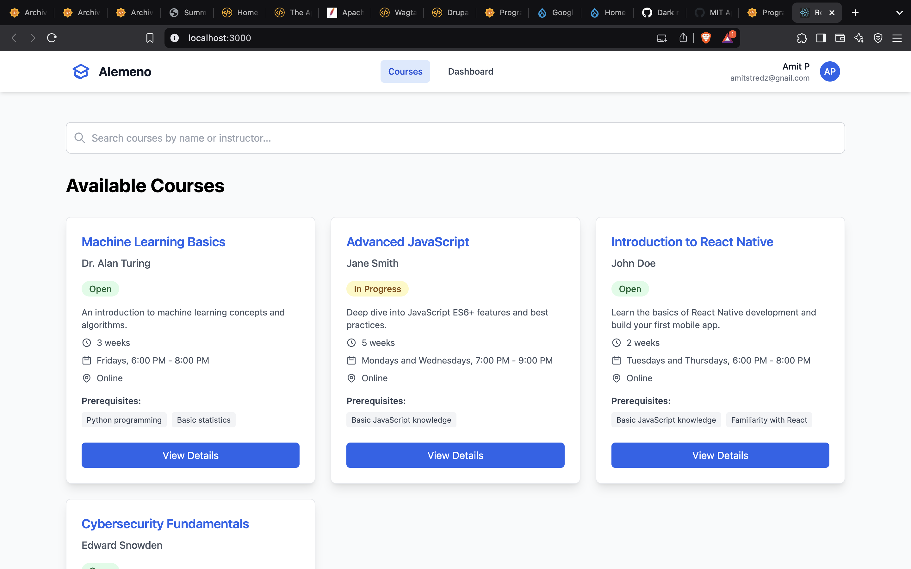
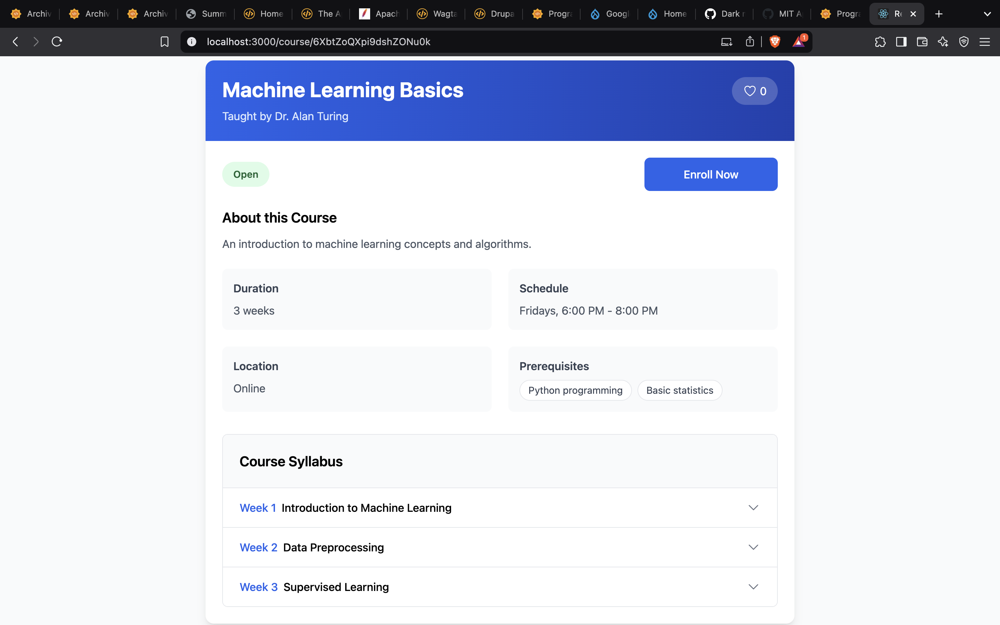
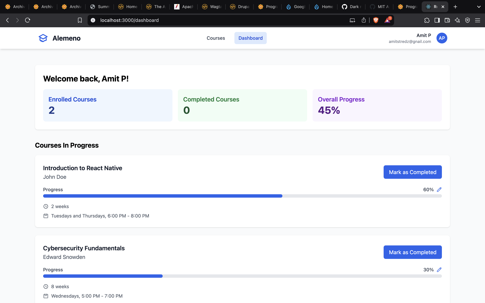
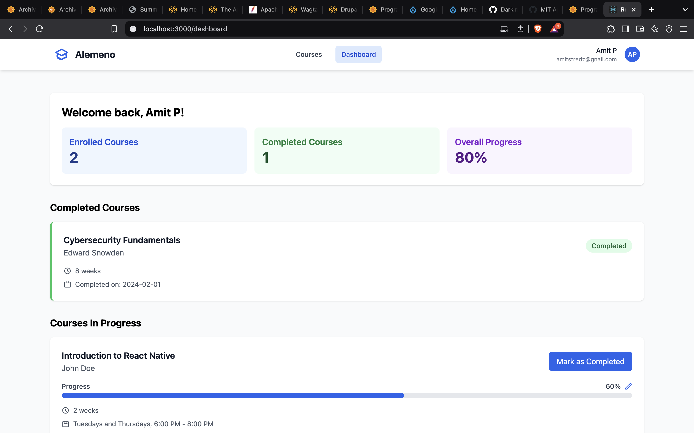

# Course Management System

A modern, responsive web application for managing online courses. Built with React, Firebase, and Redux, this application allows users to browse courses, enroll in them, and track their progress.

## Features

- **Course Catalog**

  - Browse available courses
  - Search courses by name or instructor
  - View detailed course information
  - Real-time course status updates

- **User Dashboard**

  - Track enrolled courses
  - Monitor course progress
  - View completed courses
  - Update course progress

- **Course Management**

  - Course enrollment
  - Progress tracking
  - Detailed syllabus view
  - Prerequisites display

- **Real-time Updates**
  - Firebase integration
  - Live data synchronization
  - Instant search results
  - Progress updates

## Technologies Used

- React.js
- Redux Toolkit
- Firebase/Firestore
- Tailwind CSS
- React Router

## Demo Video
[](https://youtu.be/qsnHKBkh8W0)

## Project Screenshots







## Prerequisites

Before you begin, ensure you have the following installed:

- Node.js (v14.0.0 or later)
- npm (v6.0.0 or later)
- Git

## Installation

1. **Clone the repository**

   ```bash
   git clone https://github.com/AmitStredz/react-course-app.git
   cd react-course-app
   ```

2. **Install dependencies**

   ```bash
   npm install
   ```

3. **Configure Firebase**

   - Create a new Firebase project at [Firebase Console](https://console.firebase.google.com)
   - Enable Firestore database
   - Copy your Firebase configuration
   - Create a `.env` file in the root directory
   - Add your Firebase configuration:
     `env
        REACT_APP_FIREBASE_API_KEY=your_api_key
        REACT_APP_FIREBASE_AUTH_DOMAIN=your_auth_domain
        REACT_APP_FIREBASE_PROJECT_ID=your_project_id
        REACT_APP_FIREBASE_STORAGE_BUCKET=your_storage_bucket
        REACT_APP_FIREBASE_MESSAGING_SENDER_ID=your_messaging_sender_id
        REACT_APP_FIREBASE_APP_ID=your_app_id
        REACT_APP_FIREBASE_MEASUREMENT_ID=your_measurement_id
    `

4. **Set up Firestore Database**

   - Create a 'courses' collection
   - Add course documents with the following structure:
     ```javascript
     {
       name: "Course Name",
       instructor: "Instructor Name",
       description: "Course Description",
       enrollmentStatus: "Open" | "Closed" | "In Progress",
       thumbnail: "image_url",
       duration: "8 weeks",
       schedule: "Flexible",
       location: "Online",
       prerequisites: ["prerequisite1", "prerequisite2"],
       syllabus: [
         {
           week: 1,
           topic: "Introduction",
           content: "Overview of the course"
         },
         // ... more weeks
       ],
     students: [
     {
     id: 102,
     name: "Amit",
     email: amitstredz@gmail.com
     }
     ```

5. **Start the development server**

   ```bash
   npm start
   ```

6. **Build for production**
   ```bash
   npm run build
   ```
